<div align="center">

[](README.md)
[](README.ru.md)
[](README.uz.md)

</div>

# MCP infratuzilma vositalar toʻplami


[](https://github.com/uMax-Cyber/MCPForge/actions/workflows/ci.yml)

Model Context Protocol (MCP) serverlarini ishlab chiqarish infratuzilmasiga (fayrvollar, tarmoq kontrollerlari, gipervizorlar) qarshi ishga tushirish uchun arxitektura naqshlari va xavfsizlik tizimlari. Haqiqiy joylashtirishlar asosida yaratilgan: 6 ta MCP serveri, 312 ta vosita, himoya cheklovlari bilan toʻliq kirish rejimi.

## Muammo

MCP serverlari AI agentlarga ishlab chiqarish infratuzilmasiga toʻgʻridan-toʻgʻri kirish imkonini beradi. Tartibsiz holda kuchsiz LLM lar parametrlarni tasavvur qiladi (hallucination), turli manbalardan kelgan maʼlumotlarni aralashtirib yuboradi va xatolarni maʼlumotdan ajrata olmaydi. Bu toʻplam ana shunday kirishni xavfsiz qiladigan naqshlarni taqdim etadi.

## Asosiy naqshlar

### 1. Routlangan vositalar naqshi (katta kataloglar uchun)
Serverda 200+ vosita boʻlsa, ularning barchasini LLM ga koʻrsatmang. Buning oʻrniga:
```
route_tools(query="list VMs") → tegishli vositalar nomlarini qaytaradi
call_routed_tool(name="list_vms", arguments={...})
```
Bu 200 ta vositani 3 ta koʻrinadigan vositaga siqib, kontekst oynasini tejaydi.

### 2. Xavfsizlik darajalari (avtonomiya darajalari)
```
🟢 YASHIL — oʻqish/roʻyxat/status: erkin bajarish
🟡 SARIQ — oʻchirish/rollback/oʻlchamni oʻzgartirish: avval foydalanuvchi bilan tasdiqlash
🔴 QIZIL — muhim infratuzilma (agentning oʻz xosti): HECH QACHON
```

### 3. Ikkilamchi zaxira xotira
Asosiy variant: RAG serveri (semantik qidiruv)
Zaxira: Fayl asosidagi markdown ombori (grep qidiruv)
Interfeys: ikkalasi bilan ham ishlaydigan va har doim ikkalasiga ham yozadigan yagona skript.

### 4. MCP uchun anti-hallucination qoidalari
- Maʼlumotlar faqat vositalarning haqiqiy natijalaridan
- Xato ≠ maʼlumot (xatoni xabar qiling, ishonchli raqamlarni oʻylab topmang)
- Kesilgan natija ≠ toʻliq maʼlumot
- Tekshiruvsiz turli VLAN/manbalardan faktlarni aralashtirmang
- Vosita natijasi > modelning "bilimi"

## Arxitektura

```
┌─────────────┐     ┌──────────────────┐     ┌─────────────────┐
│  AI agent   │────▶│  MCP serverlar×6 │────▶│  Infratuzilma   │
│  (Hermes)   │◀────│  (312 vosita)    │◀────│  (Proxmox/UniFi/ │
└─────────────┘     └──────────────────┘     │   Sophos/LightRAG)│
                           │                 └─────────────────┘
                           ▼
                    ┌──────────────┐
                    │ Xavfsizlik   │
                    │ qatlami      │
                    └──────────────┘
```

## Konfiguratsiya misollari

- `config/mcp_servers.yaml` — muhit oʻzgaruvchilari bilan koʻp serverli konfiguratsiya
- `config/safety_rules.yaml` — daraja boʻyicha harakatlar tasnifi
- `examples/routed_pattern.py` — routlangan vositalar chaqiruv ketma-ketligi

## Haqiqiy koʻrsatkichlar

| Koʻrsatkich | Qiymat |
|--------|-------|
| MCP serverlari | 6 (unifi, proxmox×3, sophos×2) |
| Jami vositalar | 312 |
| Serverga vositalar (routlangan) | 3 koʻrinadigan |
| Oʻqitishdan keyin xavfsizlik buzilishlari | 0/8 test |
| Oʻqitishdan keyin hallucination darajasi | 0% (8/8 test oʻtdi) |

## Litsenziya
MIT

## 📬 Aloqa

Savollaringiz bormi? Yozing: **[allumaxmail@gmail.com](mailto:allumaxmail@gmail.com)**

---

<div align="center">

[](README.md)
[](README.ru.md)
[](README.uz.md)

</div>
